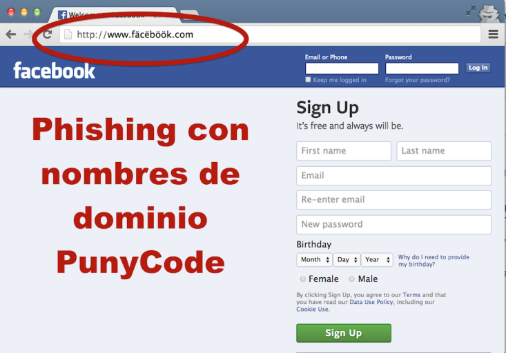
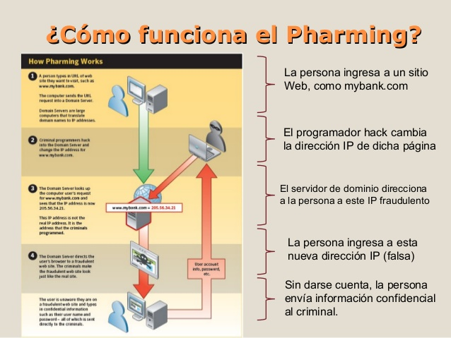
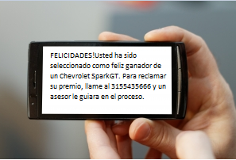

### DEFINICIÓN Y CONCEPTOS {#definici-n-y-conceptos}

La “**Suplantación de Identidad**” en general consiste en el uso de información personal para hacerse pasar por otra persona con el fin de obtener un beneficio propio. Normalmente este beneficio genera un perjuicio a la persona que sufre dicha suplantación de identidad. En el caso de menores, es un riesgo cada vez más frecuente que se produce cuando una persona malintencionada actúa en nombre del menor haciéndose pasar por él mediante la utilización de diversas técnicas.

Hay de diferenciar entre dos conceptos:

*   **Suplantación de identidad**. La suplantación de identidad consiste en la apropiación de derechos y facultades propias de la persona suplantada (por ejemplo, acceder a la cuenta de una red social).

*   **Usurpación de la identidad**. La usurpación de identidad consiste en que una vez suplantada la identidad se empiece a interactuar como si realmente fuera propietario de esos derechos y facultades (por ejemplo, realizar comentarios o subir fotografías).

Ejemplos de suplantación de identidad:

*   Registrar un perfil en una red social con el nombre de otra persona sin su consentimiento y utilizando datos o imágenes de la víctima, sería una suplantación de identidad y en principio se consideraría delito.

*   Si únicamente se registra un perfil falso por medio del nombre/alias y no se utiliza información o imágenes personales de la persona suplantada, no se consideraría delito. Para considerarse delito la apropiación no se debe limitar al nombre, sino a todas las características o datos que integran la identidad de la persona.

*   Acceder sin consentimiento a una cuenta ajena para tener acceso a la información allí almacenada. Sería una suplantación de identidad y en principio se consideraría delito (al menos un delito de descubrimiento y revelación de secretos).

*   Acceder sin consentimiento a una cuenta ajena utilizando los datos personales y haciéndose pasar por el suplantado (por ejemplo, realizando comentarios o subiendo fotografías). Sería una usurpación de identidad y se consideraría delito

*   Publicación sin consentimiento de anuncios o comentarios utilizando el nombre de un tercero o incluso utilizando sus datos personales para identificarse con terceras personas a través, por ejemplo, de correo o mensajería instantánea (Whatsapp).Sería una usurpación de identidad y se consideraría delito.

Ejemplos de suplantación de identidad entre menores.

*   Entrar sin consentimiento.

*   Acceder a información sensible como puede ser el caso de una foto o un vídeo.

*   Acosar o desprestigiar a la otra persona (casos de ciberbullying), por ejemplo, publicando comentarios polémicos o denigrantes que serán vistos por terceros.

*   Ganarse la amistad de un menor con el fin de cometer un abuso sexual (casos de grooming donde el acosador utiliza la usurpación de identidad para acceder a cuentas que sirvan de “puente” para facilitar el contacto con la víctima).

*   **_Hacerse pasar por otra persona._ **Crear una cuenta para hacerse pasar por otra persona. Aunque esta forma se suele dar en menores, es uno de los casos más frecuentemente utilizados para suplantar a gente famosa.

Técnicas más utilizadas para la suplantación de identidad

Las técnicas utilizadas para la suplantación de identidad tienen que ver con el concepto de **ingeniería social**, que se refiere al uso que hacen los ciberdelicuentes de la manipulación psicológica sobre las personas para conseguir sus fines, teniendo en cuenta la tendencia general de éstas a la confianza. Método basado en la persuasión y muy eficaz en el caso de los menores de edad que, debido tanto a su falta de experiencia y conocimientos relacionados con este tema como con su confianza e inocencia, son considerados especialmente vulnerables. Normalmente el motivo que impulsa a los adolescentes para la realización de suplantación de identidad es, habitualmente, la mera diversión. Las más utilizadas son el **Phishing , el Pharming y el** SMiShing.

**Phishing.** Es un término informático utilizado para denominar el fraude por suplantación de identidad, una técnica de ingeniería social. El término phishing procede de la palabra inglesa fishing (pesca) haciendo alusión a “picar el anzuelo”. Lo que significa que no aprovecha una vulnerabilidad en los ordenadores sino un &quot;fallo humano&quot; al engañar a los usuarios de Internet con un correo electrónico que aparentemente proviene de una empresa fiable, comúnmente de una página Web bancaria o corporativa.

Dado el cada vez más creciente número de denuncias de incidentes relacionados con el phishing en el contexto de los menores de edad, se hace necesaria la creación y utilización de métodos adicionales de protección dirigidos a los menores.

En menores de edad, uno de los servicios más utilizados por los hackers suplantar la identidad de los mismos son las redes sociales. Suelen emplear una serie de excusas para engañar al usuario tales como enviar un mensaje privado en el que le recomiendan cambiar la contraseña. En otras ocasiones crean sitios web falsos para que cuando se introduzca el correo electrónico y la contraseña se grabe y conserve esta información.

Ejemplo de Phishing en Facebook.

Imagen relacionada

Finalmente, encontramos casos de phishing a menores a través de juegos online. El objetivo sigue siendo apropiarse de cuentas, datos privados, bancarios y suplantar la identidad de los usuarios. Normalmente, la excusa que suelen emplear para engañar a los menores se encuentra relacionada con fallos de seguridad en la plataforma del juego o en la cuenta de los usuarios.

**Pharming**. Es una modalidad más peligrosa de phishing, por medio de la cual el ciberdelincuente infecta el ordenador del usuario de forma que se acaba redireccionando el tráfico web de una página legítima, utilizada habitualmente por el usuario, hacia otra página falsa creada por el ciberatacante.

La diferencia principal con phishing es que en el caso de pharming la redirección a la página falsa es automática, sin que sea necesario que el usuario necesite pulsar ningún enlace. Así, los estafadores pueden entrar en nuestro ordenador para modificar nuestros ficheros a través de virus de forma que, cuando escribamos en nuestro navegador una dirección determinada, entremos directamente en otra sin saberlo.

Resultado de imagen de pharming informatico

_Fuente._ [_https://es.slideshare.net/joycesalas/delitos-informaticos-15846183_](https://es.slideshare.net/joycesalas/delitos-informaticos-15846183)

**SMiShing**. Es una estafa en la que por medio de mensajes SMS, se solicitan datos o se pide que se llame a un número de teléfono o que se entre a una web. El objetivo del fraude puede ser suscribir al usuario a un servicio SMS Premium, ofreciéndole por ejemplo una oferta o premio especial, que llame a un número con coste adicional o estafarle con algún producto o servicio inexistente.

En este caso, al jugar en muchas ocasiones con premios y grandes oportunidades, los menores pueden caer fácilmente en la trampa accediendo a las solicitudes de los estafadores sin dudar de la autenticidad de dichos mensajes.

Resultado de imagen de smishing ejemplos

**Hacking** o intrusismo informático, consistente en el acceso no autorizado, por lo general violando los mecanismos de seguridad allí donde los haya, a los archivos y bases de datos contenidos en los sistemas informáticos ajenos, normalmente de grandes empresas o instituciones. “Las conductas de mero hacking acceso a los a los sistemas informáticos perpetrados con la única finalidad de acceder al password o puerta lógica no son actualmente constitutivos de delito pues carecen del elemento subjetivo del injusto”. (Manuel Marchena).

**Cracking,** también conocido como sabotaje informático. No debemos confundirlo con el password cracking o rompimiento o desciframiento de claves (passwords) que se asimila al hacking. En el primer sentido, Manuel Marchena en “El sabotaje informático: entre los delitos de daños y los desórdenes públicos” los define como conducta consistente en la destrucción o en la producción generalizada de daños en su sistema, datos, programas informáticos o telemáticos.

Los menores deben conocer la existencia de ciertos indicios para detectar la posibilidad de que hayan sufrido suplantación de identidad. Algunos de los más importantes son:

*   Accesos o usos anómalos de las cuentas. En este caso, por ejemplo, el indicio de suplantación lo tendríamos si nuestros contactos reciben mensajes de nuestra cuenta sin que nosotros los hubiéramos enviado.

*   Inminente desactivación de algún servicio que tuviéramos activado sin que hayamos procedido a ello.

*   Cambios en el estado de los juegos online sin que los haya realizado por sí mismo.

Las redes sociales suelen tener mecanismos de denuncia a través de los cuales ellos mismo eliminan perfiles que se consideran falsos. Si ninguna de estas dos acciones tienen el final esperado, se debe acudir a las Fuerzas y Cuerpos de Seguridad del Estado o autonómicas para interponer una denuncia.

La suplantación de personalidad es un delito, pero hay que saber cuándo se ha cometido realmente para tipificarlo como tal, pues en ocasiones produce confusión. Según el artículo 401 del Código Penal, sólo se considera delito si lo que se usurpa es el estado civil de otro (es decir, hacerse pasar por otro), y puede conllevar una pena de prisión entre seis meses y tres años.

Ateniéndonos al Código Penal si se crea un perfil falso, entonces no se puede considerar un delito de suplantación de personalidad, porque participar en una red social con datos falsos no implica un delito de usurpación de estado civil.

Otra cosa es que un individuo entre en una cuenta o perfil de otra persona, ya que se estaría cometiendo un delito contra el derecho a la privacidad debido a que se considera como una forma de revelación de secretos (caso que se recoge a partir del artículo 197 de Código Penal y se contempla como hacking). Y al mismo tiempo. Si para el acceso a la cuenta privada de un ajeno se ha tenido que cometer algún otro delito como el conseguir claves y contraseñas o provocar algún daño en el sistema informático del propietario, el delito se recoge en el artículo 264 del Código Penal y se considera cracking.