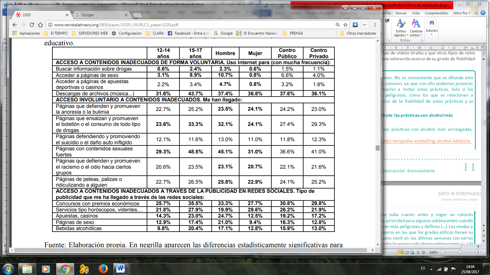

## ALGUNOS DATOS Y EJEMPLOS REALES DE SITUACIONES DE RIESGO {#algunos-datos-y-ejemplos-reales-de-situaciones-de-riesgo}

En la actualidad, los menores disponen de mucha más información y conocimiento sobre manejo de TIC, y aun así, un porcentaje elevado sigue accediendo a contenidos no apropiados para su edad.

Una reciente investigación en la que participaron una veintena de países europeos estudió la manera en que los más jóvenes utilizaban Internet, con el fin de identificar los factores de riesgo relativos a la seguridad en la Red. En ese estudio se puso de manifiesto la preocupación de los padres por el tipo de contenidos a los que tenían acceso sus hijos: imágenes explícitas de sexo o violencia (un 48%), o que pudiesen acceder a información dañina para su salud (25%).

La actividad de riesgo más común entre los menores es relacionarse vía online con gente desconocida siendo el segundo riesgo más común la exposición a peligros potenciales al acceder a contenidos inapropiados (violencia, sexo, conductas dañinas para la salud).

Fuente: Catalina García, MC López de Ayala López, A García Jiménez (2014): “Los riesgos de los adolescentes en Internet: los menores como actores y víctimas de los peligros de Internet”. Revista Latina de Comunicación Social, 69, pp. 462 a 485.

Veamos algunos ejemplos de casos reales.

1\. Tampodka, eyeballing y oxy-shots: las prácticas con alcohol más arriesgadas.

[_http://www.abc.es/sociedad/20130617/abci-tampodka-eyeballing-alcohol-adolescentes-201306111114.html_](http://www.abc.es/sociedad/20130617/abci-tampodka-eyeballing-alcohol-adolescentes-201306111114.html)

Beber alcohol con celeridad para que suba cuanto antes y coger un colocón instantáneamente se ha convertido en la prioridad para algunos adolescentes cuando salen de fiesta. Las prácticas son cada vez más peligrosas y dañinas (…). Las modas y tendencias importadas de países extranjeros en las que los grados etílicos tienen su preponderancia parecen alcanzar un nuevo cenit en las últimas semanas con varias experiencias irreflexivas que ponen a prueba la propia vida de los adolescentes. (…) El «tampodka» resulta de la fusión de los términos «tampón» y «vodka» y no es otra cosa que la introducción vía vaginal de un tampón impregnado en alcohol de alta graduación, normalmente whisky o vodka. Desde esta zona, muy irrigada, el alcohol pasa directamente a la sangre y los síntomas de la borrachera se producen con mayor intensidad y celeridad. (…)En el caso del «eyeballing», aún va más allá, puesto que introducen el alcohol en la córnea como si fuese un colirio, cogen una botella y se lo echan directamente en el ojo, lo que ocasiona no solo conjuntivitis en el menor de los casos, sino lesiones de córnea, en la mucosa (…). El «oxy-shots», que consiste en inhalar chupitos de alcohol a través de un sistema de inhalación como los asmáticos, para absorber el alcohol más velozmente por vía aérea. Esta práctica de ingerir alcohol en dispositivos de nebulización junto con oxígeno al igual que en los tratamientos broncodilatadores, como las anteriores, «daña el sistema nervioso» y esquiva el filtro hepático de la sustancia tóxica, además de que «podría acarrear patologías pulmonares graves.

2\. El reto de la canela: los peligros de un chiste de adolescentes.

[http://www.bbc.co.uk/mundo/noticias/2013/05/130424_salud_cinnamon_challenge_canela_gtg](http://www.bbc.co.uk/mundo/noticias/2013/05/130424_salud_cinnamon_challenge_canela_gtg)

El &quot;reto de la canela&quot; (Cinnamonchallenge, en inglés), ha sido el tema de muchos videos que circulan en las redes sociales, en los que se ve a adolescentes intentando tragar una cucharada de canela en polvo en 60 segundos sin la ayuda de agua. Las imágenes muestran que, poco después, la gente expulsa parte del polvo por la nariz, en lo que se conoce como &quot;aliento de dragón&quot;. Puede parecer apenas una broma tonta, pero expertos médicos aseguran que puede causar problemas de respiración, inflamación, sarpullido, irritación, ataques de asma y cicatrices en el pulmón que pueden durar años, si no para siempre. (…) Sólo en 2012, en Estados Unidos se registraron más de 220 llamadas al centro de envenenamiento de jóvenes afectados tras ingerir canela en polvo sin agua. A más de 30 se les recomendó atención médica inmediata.

3\. El 21% de los adolescentes españoles están en riesgo de ser adictos a Internet

[http://sociedad.elpais.com/sociedad/2013/01/15/actualidad/1358257857_400678.ht](http://sociedad.elpais.com/sociedad/2013/01/15/actualidad/1358257857_400678.html)

El 21,3 % de los adolescentes españoles presentan indicios de desarrollar una conducta adictiva a Internet por el elevado tiempo que pasan conectados a la Red. Es decir, presentan indicios de aislamiento, irascibilidad y dejan de hacer cosas que antes hacían por estar en las redes sociales. Esta es la conclusión a la que ha llegado un estudio realizado sobre conductas adictivas en Internet, hecho en siete países europeos por la asociación Protégeles (…). El 58% de los jóvenes europeos ha accedido a imágenes pornográficas en la Red, aunque para un 33% esta ha sido una experiencia &quot;desagradable&quot;. España se sitúa entre los porcentajes más bajos de exposición a este tipo de imágenes.